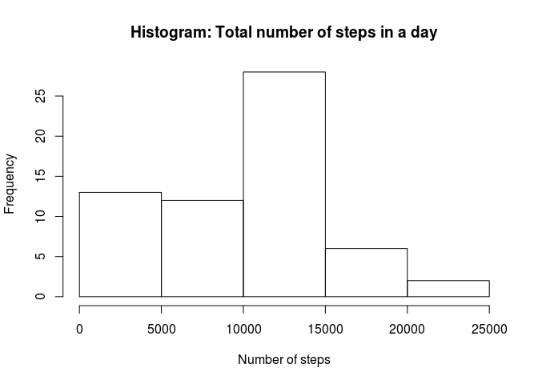
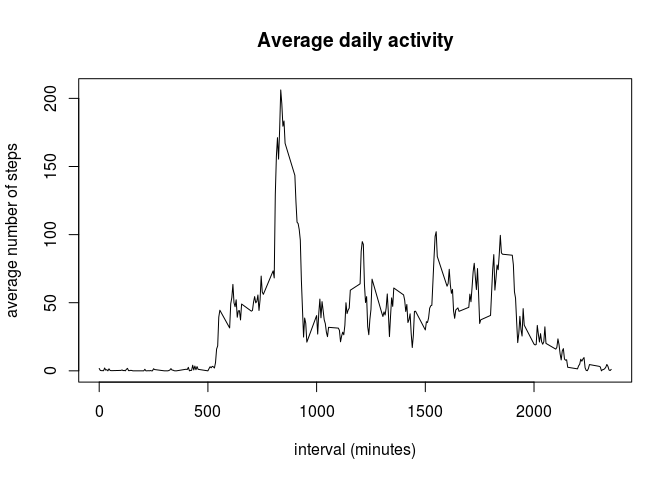
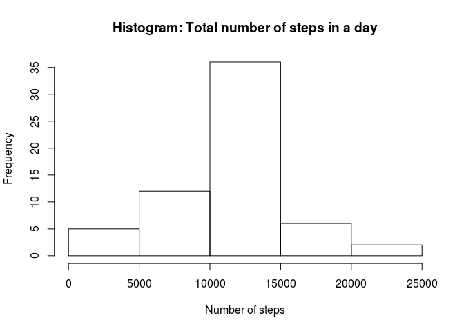
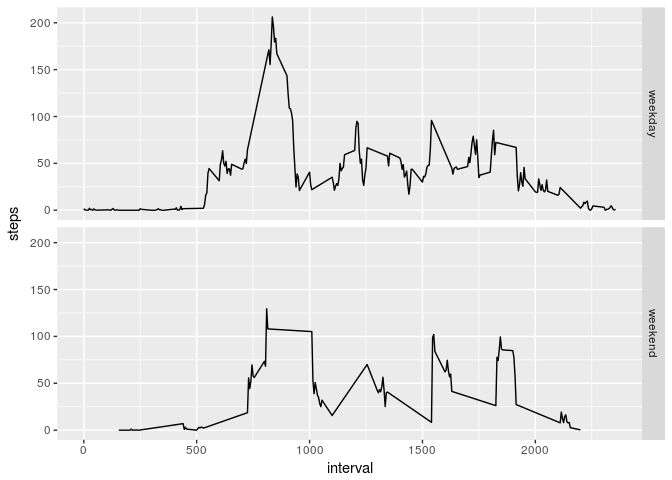

## Loading and preprocessing the data


```r
ActMon<-read.csv(unzip("activity.zip"))
head(ActMon)
```

```
##   steps       date interval
## 1    NA 2012-10-01        0
## 2    NA 2012-10-01        5
## 3    NA 2012-10-01       10
## 4    NA 2012-10-01       15
## 5    NA 2012-10-01       20
## 6    NA 2012-10-01       25
```

```r
str(ActMon)
```

```
## 'data.frame':	17568 obs. of  3 variables:
##  $ steps   : int  NA NA NA NA NA NA NA NA NA NA ...
##  $ date    : Factor w/ 61 levels "2012-10-01","2012-10-02",..: 1 1 1 1 1 1 1 1 1 1 ...
##  $ interval: int  0 5 10 15 20 25 30 35 40 45 ...
```

Changing "date" variable type to Date format:

```r
ActMon$date = as.Date(as.character(ActMon$date, "%Y%m%d"))
str(ActMon)
```

```
## 'data.frame':	17568 obs. of  3 variables:
##  $ steps   : int  NA NA NA NA NA NA NA NA NA NA ...
##  $ date    : Date, format: "2012-10-01" "2012-10-01" ...
##  $ interval: int  0 5 10 15 20 25 30 35 40 45 ...
```


## What is mean total number of steps taken per day?


```r
totStep_day <- tapply(ActMon$steps, ActMon$date, sum, na.rm = TRUE)
hist(totStep_day, main = "Histogram: Total number of steps in a day", xlab = "Number of steps")
```

<!-- -->

```r
mean(totStep_day, na.rm = TRUE)
```

```
## [1] 9354.23
```

```r
median(totStep_day, na.rm = TRUE)
```

```
## [1] 10395
```


## What is the average daily activity pattern?


```r
meanStep_interval <- tapply(ActMon$steps, ActMon$interval, mean, na.rm = TRUE)
plot(names(meanStep_interval), meanStep_interval, type = "l", xlab = "interval (minutes)", ylab = "average number of steps", main = "Average daily activity")
```

<!-- -->

```r
meanStep_interval[which.max(meanStep_interval)]
```

```
##      835 
## 206.1698
```

## Imputing missing values

Number of rows with missing values:

```r
ok <- complete.cases(ActMon)
bad <- sum(!ok)
bad
```

```
## [1] 2304
```
Having regard the daily pattern, I think that would be reasonable to input the missing number of steps using the average number of steps for the 5-minutes interval:

```r
ActMon_imputed <- merge(ActMon, meanStep_interval, by.x = "interval", by.y = 0, sort = FALSE)
ActMon_imputed$steps[is.na(ActMon_imputed$steps)] <- ActMon_imputed$y[is.na(ActMon_imputed$steps)]
totStep_day2 <- tapply(ActMon_imputed$steps, ActMon_imputed$date, sum)
hist(totStep_day2, main = "Histogram: Total number of steps in a day", xlab = "Number of steps")
```

<!-- -->

```r
mean(totStep_day2)
```

```
## [1] 10766.19
```

```r
median(totStep_day2)
```

```
## [1] 10766.19
```
Imputing missing number of steps with an average value, the new histogram is closer to a normal distribution. 
The mean and the median of steps is naturally increasing. 

## Are there differences in activity patterns between weekdays and weekends?

Setting local time to English (for Ubuntu OS, for Windows : "Sys.setlocale("LC_ALL","English")")

```r
Sys.setlocale("LC_TIME", "en_US.UTF-8")
```

```
## [1] "en_US.UTF-8"
```

```r
ActMon_imputed$wd <- weekdays(ActMon$date)
ActMon_imputed$wd2 <- ActMon_imputed$wd == "Saturday" | ActMon_imputed$wd == "Sunday"
ActMon_imputed$wd2 <-factor(as.character(ActMon_imputed$wd2), labels = c("weekday", "weekend"))
library(ggplot2)
ggplot(ActMon_imputed, aes(x = interval, y = steps)) + stat_summary(fun.y = "mean", geom = "line") + facet_grid(wd2~.)
```

<!-- -->

During the weekend generally there is a lower activity and the peak at 835 minutes-interval is much lower. 
